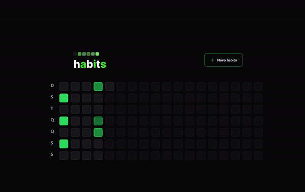
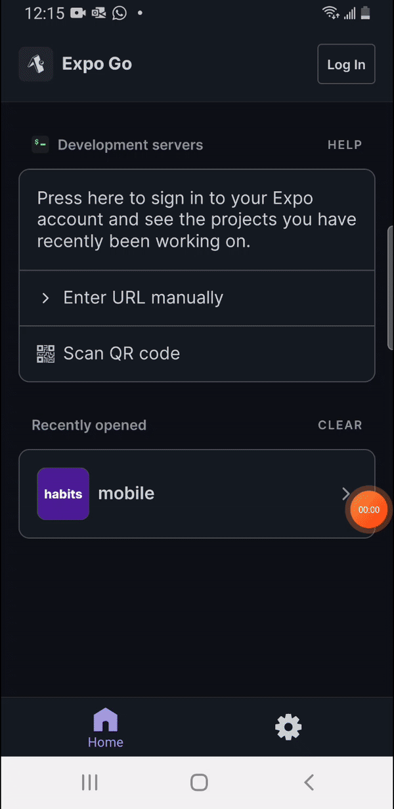

<h1 align="center">NLW-Setup Ignite 🚀 - Habits</h1>

O habits é um aplicativo de gestão de hábitos que foi desenvolvido ao longo do evento NLW Setup da <a href="https://www.rocketseat.com.br/">Rocketseat.</a>

Um evento gratuito, promovido pela Rocketseat para ensino de tecnologias WEB. 

  <a href="#-projeto">Projeto</a>&nbsp;&nbsp;&nbsp;|&nbsp;&nbsp;&nbsp;
  <a href="https://welbert-luiz-silva.github.io/Habits/">Site</a>&nbsp;&nbsp;&nbsp;|&nbsp;&nbsp;&nbsp;
  <a href="#-layout">Layout</a>&nbsp;&nbsp;&nbsp;|&nbsp;&nbsp;&nbsp;
  <a href="#-tecnologias">Tecnologias</a>&nbsp;&nbsp;&nbsp;|&nbsp;&nbsp;&nbsp;
  <a href="#memo-licença">Licença</a>

  

 

## 🔧 Projeto

O Habits é um programa de gestão de hábitos dos usuários. Nele é possível cadastrar um hábito e depois usar uma lista de checagem para controlar as atividades já realizadas, o usuário também pode ao cadastrar um hábito, escolher os dias da semana em que vai querer registrar o respectivo hábito. Após o término do dia não é mais possível editar a lista de hábitos, mas as listas ficam gravadas e é possível visualizá-las clicando no respectivo dia.

## 🔖 Layout
### 💻 Web

  

 

- <h2>A página web é toltalmente responsiva</h2>

  

 

### 📲 Mobile

  

 

## 🚀 Tecnologias

Esse projeto foi desenvolvido com as seguintes tecnologias:

        
   
   

## :memo: Licença

Esse projeto está sob a licença MIT.

---

